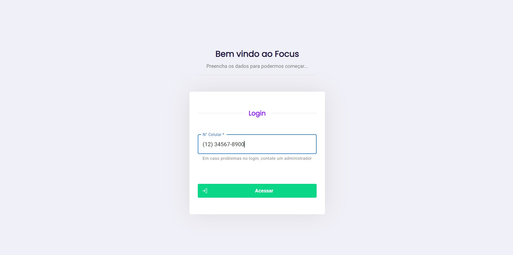
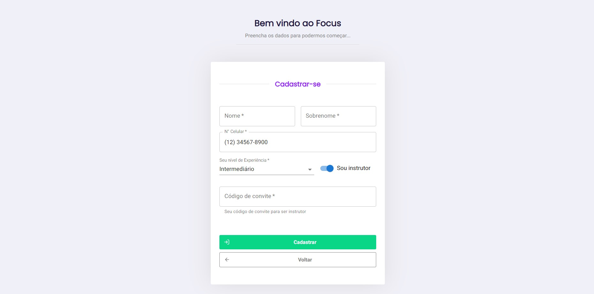
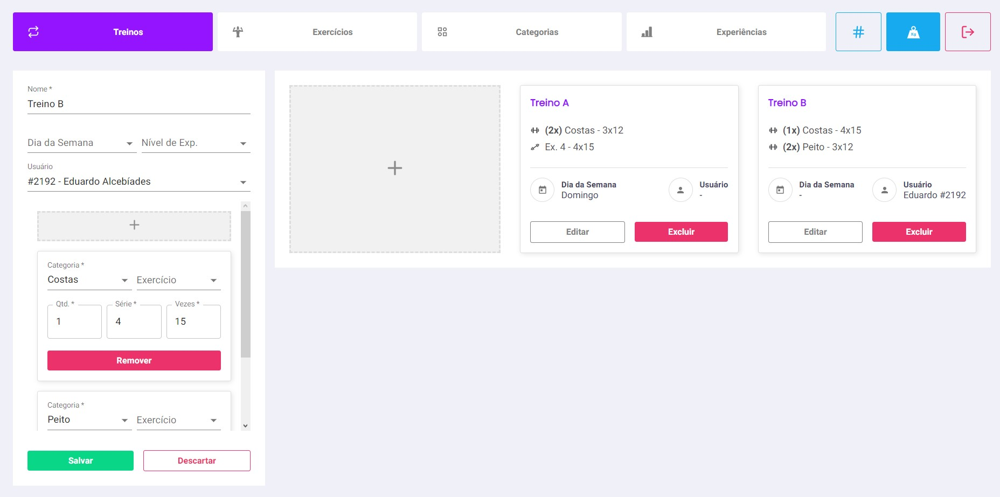
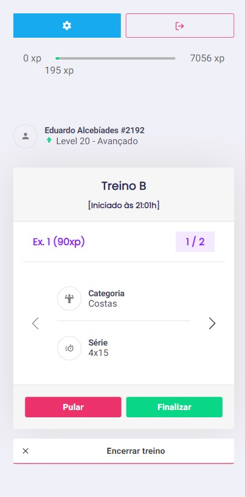
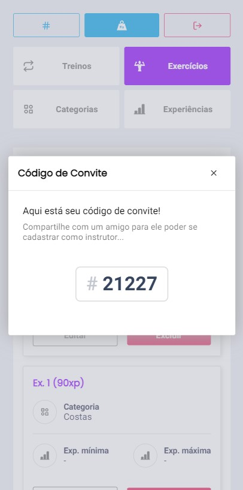

# UI do Focus

O projeto foi desenvolvido utilizando [React](https://pt-br.reactjs.org), e consiste em um sistema Web responsivo academia. Nele é possível ter usuários comuns e treinadores, no qual um treinador cadastra rotinas de treino no qual serão usadas pelos usuários durante seu dia a dia.

## Dependências

Para executar o projeto, é necessário ter instalado em sua máquina o [NodeJS](https://nodejs.org/pt-br/).

Também erá necessário instalar as dependências com o seguinte comando:

```
$ npm install
```

O projeto está consumindo serviços de uma API de calculadora disponível em https://github.com/EduardoAlcebiades/focus-api. Será necessário a utilização dessa API para correto funcionamento do projeto. O url de tal API pode ser ajustado no arquivo .env

# Iniciando servidor

Para iniciar o servidor é necessário rodar o seguinte comando:

```
$ npm start
```

O servidor será iniciado em http://localhost:3000.

# Prints do Projeto







